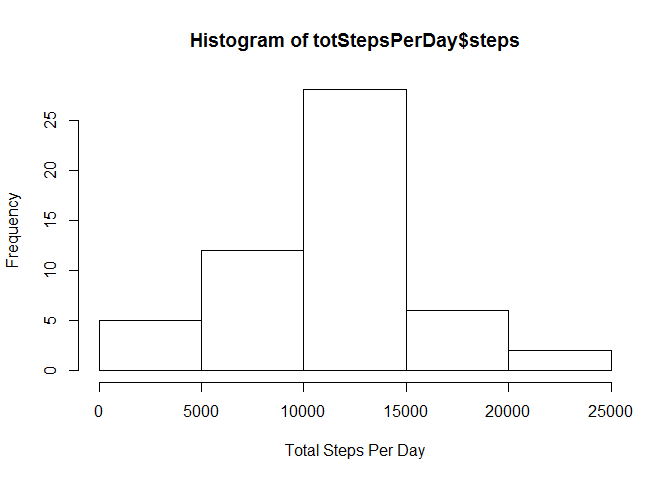
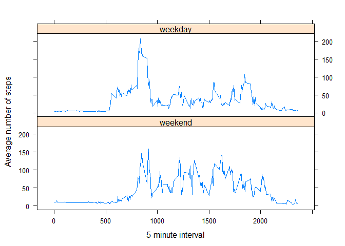

# Reproducible Research: Peer Assessment 1


## Loading and preprocessing the data

```r
data <- read.csv(unz("activity.zip", "activity.csv"), header=T, quote="\"", sep=",")
```

## What is mean total number of steps taken per day?

```r
totStepsPerDay <- aggregate(steps~date, data = data, FUN = sum)
hist(totStepsPerDay$steps,xlab = "Total Steps Per Day")
```

<!-- -->

The mean total number of steps taken per day is 1.0766189\times 10^{4} and median total number of steps taken per day is 10765

## What is the average daily activity pattern?

```r
meanStepsPerInterval <- aggregate(steps~interval, data = data, FUN = mean)
plot(meanStepsPerInterval$interval,meanStepsPerInterval$steps, type = "l", xlab = "5-minute interval", ylab = "Average number of steps")
```

<!-- -->

```r
maxStepsInterval<- meanStepsPerInterval[meanStepsPerInterval$steps==max(meanStepsPerInterval$steps),]$interval
```

On average across all the days in the dataset, the maximum number of steps contain by the interval 835

## Imputing missing values

```r
totalMissing<-sum(is.na(data$steps))
```
The total number of missing values in the dataset are 2304

```r
missingData<-data[is.na(data$steps),]
missingData<-merge(missingData,meanStepsPerInterval,by="interval")
dataWOMissing<-data
dataWOMissing[is.na(data$steps),]$steps<-missingData$steps.y
totStepsPerDayWOMissing <- aggregate(steps~date, data = dataWOMissing, FUN = sum)
hist(totStepsPerDay$steps,xlab = "Total Steps Per Day")
```

<!-- -->

After filling the missing values with mean value of that interval the mean total number of steps taken per day is 1.0766189\times 10^{4} and median total number of steps taken per day is 1.1015\times 10^{4}

Filling missing values in the original dataset with the mean steps for that interval resulted in same average number of steps taken per day but the median number of steps taken per day changed.

## Are there differences in activity patterns between weekdays and weekends?

```r
dataWOMissing$date<-as.Date(dataWOMissing$date)
dataWOMissing$isWDay<-factor((weekdays(dataWOMissing$date) %in% c("Saturday","Sunday")),levels=c('TRUE','FALSE'), labels = c('weekend','weekday'))
meanStepsPerIntervalWeek<-aggregate(steps~interval+isWDay,data = dataWOMissing,FUN = mean)
library(lattice)
xyplot(steps~interval | factor(isWDay), data=meanStepsPerIntervalWeek, type = "l", xlab = "5-minute interval", ylab = "Average number of steps", layout=c(1,2))
```

<!-- -->

